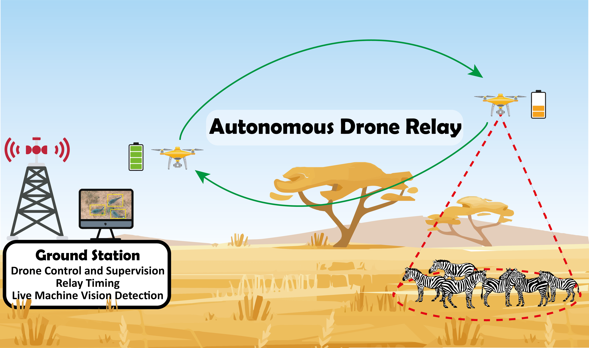
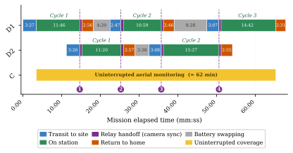
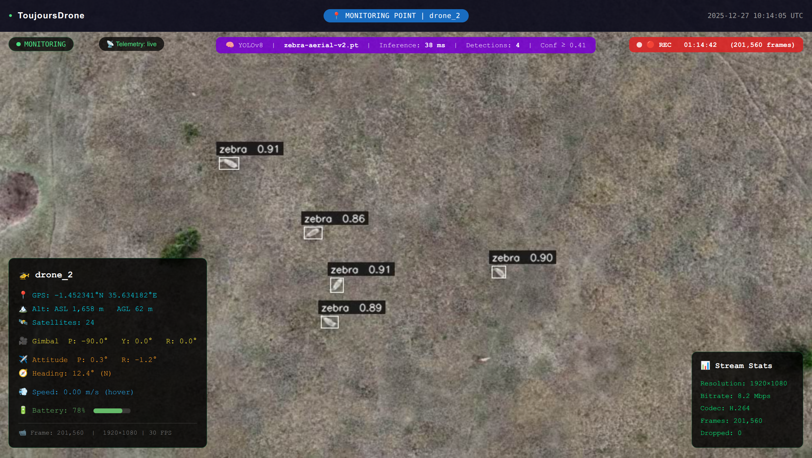
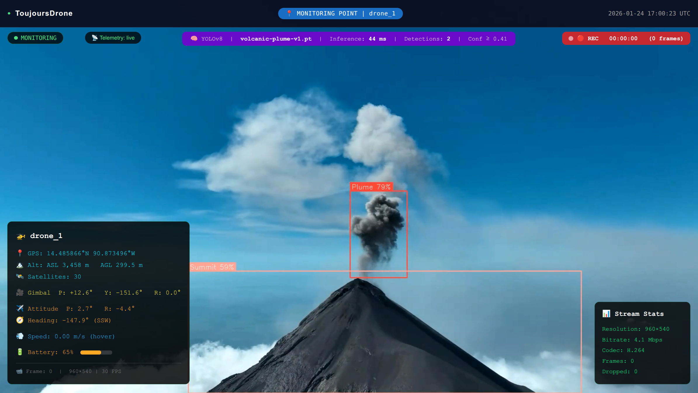
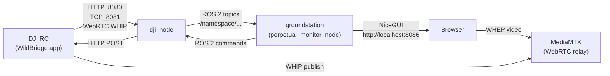

# SkyLoop

**SkyLoop** is an autonomous multi-drone relay system for *perpetual* monitoring, built on [ROS 2 Humble](https://docs.ros.org/en/humble/) and [DJI drones](https://developer.dji.com/). It keeps a single field site under **continuous aerial observation** by handing the camera watch from one drone to the next as batteries run low — so a location can be monitored for hours.

<p align="center">
  
  <br/>
  <em>Uninterrupted relay monitoring over a zebra herd in the field</em>
</p>

> **Drone control requires the [WildBridge](https://github.com/WildDrone/WildBridge) Android app** running on each DJI Remote Controller. WildBridge exposes drone telemetry, control, and video streaming over a local Wi-Fi network — SkyLoop communicates with it over HTTP and TCP.

---

## Features

- **Perpetual relay missions** — multiple drones take turns at a monitoring point; handoffs are scheduled automatically so coverage never lapses.
- **Battery-drain RTH predictor** — linear regression over live battery telemetry predicts when DJI will force a return-to-home, triggering the next drone launch at the right moment.
- **Web-based ground station** — NiceGUI browser interface with an interactive map, per-drone status cards, relay countdown, and event log; accessible at `http://localhost:8086`.
- **Live YOLO detection** — in-browser YOLOv8 object detection overlaid on the fullscreen drone video stream.
- **WebRTC video** — low-latency live feed from each drone via WHIP/WHEP through MediaMTX.
- **Auto-discovery option** — drones are found automatically on the LAN via UDP broadcast, multicast, or mDNS.
- **Docker-first deployment** — single `docker compose up` command brings the full system up.

---

## How it works

A single DJI drone gives roughly 20–40 minutes of flight. SkyLoop chains several drones into one continuous observer: while one drone monitors the target, the ground station predicts when it must return home and launches the next drone early enough to arrive, match the camera view, and take over — before the first one leaves. The departing drone flies home, lands, and waits for a battery swap before rejoining the queue.

<p align="center">
  
  <br/>
  <em>Gantt chart example from real-world flights of a two-drone relay mission: overlap windows ensure unbroken coverage</em>
</p>


**State machine** — each drone progresses through well-defined states managed by `MissionController`:

```
IDLE → SETTING_RTH_ALTITUDE → TAKING_OFF → CLIMBING_TO_ALTITUDE
     → TRANSIT_TO_MONITORING → APPROACHING_POINT → MONITORING
     → WAITING_FOR_RELAY → CAMERA_SYNC → RETURNING_HOME → COMPLETED
```

During `CAMERA_SYNC`, the arriving drone performs a 360° yaw rotation so the outgoing drone's camera view can be matched before handoff.

---

## Machine vision

The live video feed can run an in-browser YOLOv8 object detector, overlaying bounding boxes and telemetry on the fullscreen stream — useful for spotting and counting animals during a mission without any server-side GPU.

| Zebra herd detection | Volcano scene |
|---|---|
|  |  |

---

## Architecture

```
SkyLoop/
├── src/
│   ├── groundstation/groundstation/
│   │   ├── perpetual_monitor_gui.py   # NiceGUI web interface (entry point)
│   │   ├── perpetual_monitor.py       # ROS 2 node base: pub/sub + drone commands
│   │   ├── mission_controller.py      # Relay state machine (MissionController)
│   │   ├── navigation.py              # Pure great-circle + travel-time math
│   │   ├── rth_prediction.py          # Battery-drain RTH predictor
│   │   ├── models.py                  # Domain dataclasses / enums
│   │   ├── mission_logging.py         # Per-session CSV logging
│   │   ├── video_templates.py         # Fullscreen video / WebRTC / YOLO HTML
│   │   ├── static/                    # Client-side JS (YOLO, WebRTC)
│   │   └── arrow.py, formatting.py    # UI helpers
│   ├── dji_controller/dji_controller/
│   │   ├── controller.py              # ROS 2 node (DjiNode) — one per drone
│   │   └── submodules/dji_interface.py# WildBridge HTTP/TCP client
│   └── wildview_bringup/
│       └── launch/perpetual_monitoring.launch.py
├── tools/                             # Offline analysis scripts (e.g. rth_predictor.py)
├── media/                             # README images (tracked by git)
├── Dockerfile
├── docker-compose.yml
└── requirements.txt
```

### ROS 2 nodes

| Executable | Package | Role |
|---|---|---|
| `perpetual_monitor_node` | `groundstation` | Web UI, mission control, relay logic |
| `dji_node` | `dji_controller` | One instance per drone — bridges ROS 2 ↔ WildBridge |

The `groundstation` node is the system entry point. It spawns a `dji_node` process for each drone as it connects through the UI.

### Data flow



---

## Prerequisites

- **Docker ≥ 24** and **Docker Compose ≥ 2** — recommended deployment method
- **[WildBridge](https://github.com/WildDrone/WildBridge)** installed and running on each DJI Remote Controller (provides the HTTP/TCP bridge that SkyLoop communicates with)
- DJI drone(s) supported by WildBridge (Mini 3/4, Mavic 3E, M30, M300, M350, M4T)
- All devices on the **same Wi-Fi LAN**
---

## Installation

### Docker (recommended)

```bash
git clone https://github.com/edouardrolland/WildPerpetua.git
cd WildPerpetua

# Optional — one-time host setup for ROS 2 topic access outside the container
./setup_ros2_host.sh && source ~/.bashrc

docker compose build
docker compose up -d
```

Open **http://localhost:8086** in a browser.

---

## Quick Start

1. **Set up WildBridge** on each DJI RC following the [WildBridge installation guide](https://github.com/WildDrone/WildBridge). Note each RC's IP address.

2. **Launch SkyLoop**:

   ```bash
   # Docker
   docker compose up -d
   ```

3. **Open the web UI** at `http://localhost:8086`.

4. **Connect a drone** — enter the RC's IP and a name, click *Connect*. Repeat for each drone.

5. **Define the monitoring point** — click the map or enter coordinates, set altitude and camera heading.

6. **Start a relay mission** — select *Relay*, add drones to the queue, and click *Start Mission*. SkyLoop will handle all scheduling automatically.

---

## Usage

### Web UI

The ground station is entirely browser-based. After launch, open `http://localhost:8086`.

| Panel | Description |
|---|---|
| Map | Click to set the monitoring point; shows drone positions in real time |
| Drone cards | Per-drone status: battery, altitude, speed, flight mode, RTH countdown |
| Mission panel | Start/stop single or relay missions; manual swap button |
| Event log | Timestamped record of all mission events and state transitions |
| Fullscreen video | Live WebRTC feed per drone with optional YOLO detection overlay |

### Mission modes

- **Single** — one drone flies to the monitoring point and hovers until battery forces RTH.
- **Relay** — drones cycle through the monitoring point continuously. SkyLoop launches the next drone automatically when the RTH predictor fires, ensuring overlap at handoff.

---

## Configuration

Runtime behavior is controlled via environment variables (defaults target the Docker layout):

| Variable | Default | Purpose |
|---|---|---|
| `SKYLOOP_RECORDING_DIR` | `/SkyLoop/recordings` | Directory for video and telemetry recordings |
| `SKYLOOP_ROSBAG_DIR` | `/SkyLoop/src/rosbags` | ROS bag output directory |
| `SKYLOOP_AUTO_CONNECT` | *(built-in list)* | `ip:name,ip:name,...` — drones to connect automatically at startup; leave empty to disable |

Set these in `docker-compose.yml` or export them before launching natively.

### Navigation mode

Inside `MissionController`, two navigation backends are available:

| Mode | Speed | Notes |
|---|---|---|
| PID (default) | 5 m/s | Virtual Stick PID; includes yaw control during transit |
| DJI Native | up to 15 m/s | KMZ waypoint mission; smoother trajectory, yaw set on arrival |

Switch modes via the `use_dji_native` flag in `mission_controller.py` or from the web UI when available.

---

## ROS 2 Interface

Each drone runs under its own ROS 2 namespace (e.g. `/drone_1/`).

### Telemetry topics (published by `dji_node`)

| Topic | Type | Description |
|---|---|---|
| `location` | `sensor_msgs/NavSatFix` | GPS position |
| `speed` | `std_msgs/Float64` | Velocity magnitude (m/s) |
| `heading` | `std_msgs/Float64` | Compass heading (degrees) |
| `attitude` | `std_msgs/String` | JSON `{pitch, roll, yaw}` |
| `battery_level` | `std_msgs/Float64` | Battery percentage |
| `flight_mode` | `std_msgs/String` | DJI flight mode string |
| `remaining_flight_time` | `std_msgs/Float64` | Estimated remaining flight time (s) |
| `time_needed_to_go_home` | `std_msgs/Float64` | RTH time estimate (s) |
| `distance_to_home` | `std_msgs/Float64` | Distance to home point (m) |
| `waypoint_reached` | `std_msgs/Bool` | Final waypoint reached flag |
| `zoom_ratio` | `std_msgs/Float64` | Camera zoom ratio |
| `manual_override_active` | `std_msgs/Bool` | Pilot override is active |

See [src/dji_controller/dji_controller/controller.py](src/dji_controller/dji_controller/controller.py) for the full list (25+ topics).

### Command topics (subscribed by `dji_node`)

| Topic | Type | Payload |
|---|---|---|
| `command/takeoff` | `std_msgs/Empty` | — |
| `command/land` | `std_msgs/Empty` | — |
| `command/rth` | `std_msgs/Empty` | — |
| `command/abort_mission` | `std_msgs/Empty` | — |
| `command/enable_virtual_stick` | `std_msgs/Empty` | — |
| `command/goto_waypoint` | `std_msgs/Float64MultiArray` | `[lat, lon, alt, yaw, speed?]` |
| `command/goto_trajectory` | `std_msgs/String` | `"[(lat,lon,alt),...], finalYaw"` |
| `command/goto_trajectory_dji_native` | `std_msgs/String` | `"(speed, [(lat,lon,alt),...])"` |
| `command/goto_yaw` | `std_msgs/Float64` | Yaw angle (degrees) |
| `command/gimbal_pitch` | `std_msgs/Float64` | Pitch (degrees) |
| `command/zoom_ratio` | `std_msgs/Float64` | Zoom ratio |

---


---


## License

[MIT](LICENSE) © Edouard Rolland

---

## Maintainers

[@edouardrolland](https://github.com/edouardrolland)

---

## Acknowledgements

This work is supported by:

- The **WildDrone** MSCA Doctoral Network, funded by the European Union's Horizon Europe programme under grant agreement no. 101071224
- The **Innovation Fund Denmark** (DIREC U07 — PERSIST)
- The **Independent Research Fund Denmark** (Grant 10.46540/4264-00105B — NAMUR)

Built as part of the [**WildDrone**](https://wilddrone.eu/) project.

Drone control relies on the [**WildBridge**](https://github.com/WildDrone/WildBridge) open-source Android app (Rolland et al., RiTA 2025), which exposes DJI SDK V5 telemetry, control, and video over a local network without requiring proprietary SDK dependencies on the ground station.

If you use SkyLoop in your research, please also cite WildBridge:

```bibtex
@inproceedings{Rolland2025WildBridge,
  author    = {Edouard G.A. Rolland and Kilian Meier and Murat Bronz and
               Aditya M. Shrikhande and Tom Richardson and
               Ulrik P.S. Lundquist and Anders L. Christensen},
  title     = {{WildBridge}: Ground Station Interface for Lightweight
               Multi-Drone Control and Telemetry on {DJI} Platforms},
  booktitle = {Proceedings of the 13th International Conference on
               Robot Intelligence Technology and Applications (RiTA 2025)},
  year      = {2025},
  month     = {December},
  publisher = {Springer},
  address   = {London, United Kingdom},
  note      = {In press},
}
```
